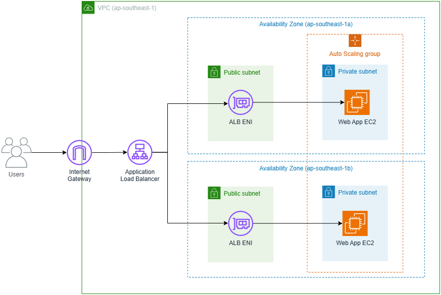

# Terraform Sample Web App

## Architecture Diagram and Explainations

**The architecture diagram and explainations in ppt can be found here**:
https://docs.google.com/presentation/d/18fz_6QWkCfstpJJ5sWUNC9-kGX1twYViy6NZdu6xt1Y/edit?usp=sharing

## Deployment Video
#### https://youtu.be/o7CgmprTe2U

## Deployment Requirements
* [Terraform](https://developer.hashicorp.com/terraform/downloads?product_intent=terraform) installed
* [AWS CLI](https://aws.amazon.com/cli/) installed and running `aws configure` to associate your AWS credentials. 

## Deployment steps
1. Change directory into `./simple-webapp`
2. Run `terraform init`
3. Run `terraform apply` and enter `yes` when prompted.

